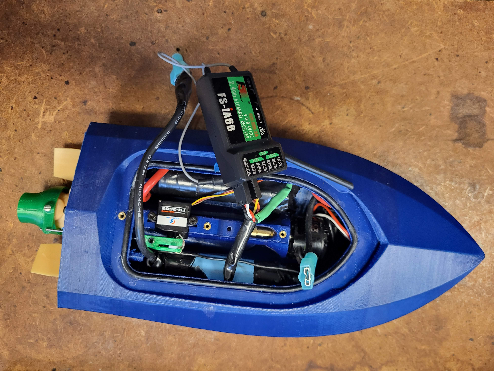

# JetBoat CV: A project to build and track a Thrust Vector Controlled Jet boat using Computer Vision
The aim of this project was to 3d print and assemble a TVC RC Jetboat and then using a camera system determine its position and rotation in the frame. This data could then be relayed to a motion controller that could interface with the jetboat to serve as autonomous boating. Unfortunately, the second part never happened, only the boat and tracking did.

# State of Project
This was a semester long project for Advanced Lab. I had lofty goals to complete and encountered numerous road blocks that lessened the amount I could feasibly complete. Tracking works decent at low speeds, but fails at higher speeds. The best way to counteract this would be reducing motion blur with faster frames or by redesigning the entire positioning system. 

See the following demo on how it currently works:

# How to
Note: some of these instructions will be specific to my build of the boat so anyone returning to the project at Juniata College has a decent starting point.

## JetBoat

### Jet Boat Construction
The jetboat is a direct build from https://cults3d.com/en/3d-model/game/rc-mini-jet-boat using version 3.0. Modifications were made to the servo arm and propellor to increase the wall thickness and allow for a larger set screw; however I cannot share these models due to the license. I printed in PLA using the reccomended settings in the link above.

### Charging
In order to charge the JetBoat, a LiPo balance Charger is required with support for a 2S balance and with the wires setup to support the connectors in the boat. Then connect the leads appropriately (+ to +, - to -, and the balance cable into the balance port(aligning red with +)).

### Controling and Quirks
Use the FS-i6X controller. The left stick(CH3) is setup to handle throttle(start gentle) and the right does left/right movemenet of the nozzle(CH1). Occasionally the nozzle will get stuck in a turning position. Applying a little pressure back towards the center usually centers it back out. 

## ArUco Codes
There are 2 codes that need to be taped to the boat included in this repository. THey are available here:
|        |             |
|--------------------|--------------------|
| [Code 0](JetBoatCV/marker0.svg) | [Code 1](JetBoatCV/marker1.svg) |

## Software

The software is written in C++ for OpenCV v4.8.0 using Microsoft Visual Studio 2022.

### OpenCV
You will need to build OpenCV manually using the following additional libraries:
- opencv_contrib
- Gstreamer
- Intel TBB
- Intel MKL
- Eigen
- Microsoft Onnx Runtime
Build openCV for both release and debug mode.

### Building the software
The software should be well configured to open in visual Studio. You may have to update the properties to point to the new openCV libraries. See [Windows Visual Studio OpenCV Configuration](https://docs.opencv.org/4.x/dd/d6e/tutorial_windows_visual_studio_opencv.html)
As long as everything is configured correctly, the software should be able to be built in both debug and release mode. Release mode runs significantly faster, especially for object tracking. 

### Running the software
Before the software is started, ensure your camera is connected. Start the software and it should display two windows with video output from the camera. If it crashes because it is unable to open the camera or it displays the wrong feed, change the camera id it opens in CameraThread.cpp. 

Once it displays the video feed, it will begin looking for the ArUco codes. You can adjust the brightness and contrast in the other window to improve detection. The ArUco codes will be outlined in green and the center of the boat will be identified. Additionally a course will be plotted aligned with the boat.

When ready, press the enter key. This will begin the main loop, where it will also activate the KCF tracker and begin tracking the boat, displaying its position and incrementing the score according to your performance in following the course.

# Code Architecture
This runs as a multi threaded application:
- Main Thread
    - Window thread
    - Camera Thread
    - MultiTracker Thread
        - ArUco tracker
        - KCF Tracker

The camera thread generates a frame. Each thread grabs the latest frame for its own processing.